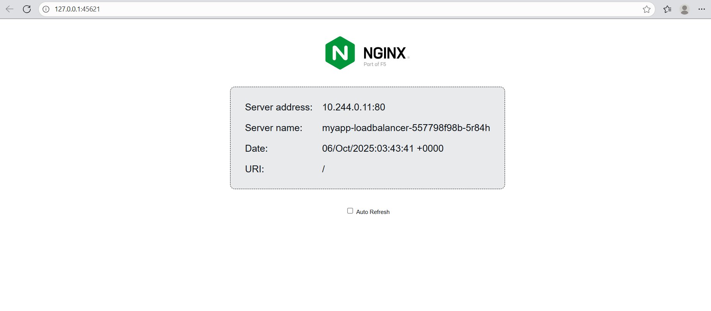
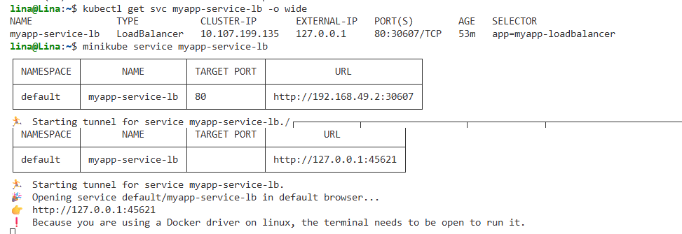

1. CLUSTER IP, INGRES AL POD Y EN EL POD LA CONSULTA AL SERVICIO DE NGINX MEDIANTE UN CURL

2. NODEPORT

Dado que: se ejecuta minikube con Docker Desktop como controlador de contenedor, se necesita un túnel de minikube. Esto se debe a que los contenedores dentro de Docker Desktop están aislados del equipo host.

Para ello se ejecuta en una terminal el comando a continuación:

Al acceder a la url indicada se evidencia que efectivamente funciona:

E igualmente se realiza la validación por consola: 

3. LOAD BALANCER

Creación del deployment y exposición del servicio:

Establecimiento de tunel: 

Sin embargo, es importante destacar que, en entornos de nube, el tipo de servicio LoadBalancer crea un balanceador externo con una IP pública. En este entorno local con Minikube, se simuló dicho comportamiento utilizando el comando minikube tunnel, el cual asigna la dirección IP 127.0.0.1 al servicio para enrutar el tráfico local hacia los pods.

No obstante, al ejecutarse dentro de WSL, este túnel es accesible únicamente desde la máquina virtual de Minikube (o dentro del mismo entorno WSL), como se observa en la imagen anterior. Por este motivo, las pruebas realizadas desde los pods respondían correctamente, mientras que las solicitudes externas desde el entorno WSL no obtenían respuesta.

Finalmente, la validación del servicio se realizó mediante el comando minikube service myapp-service-lb, que permite exponer y acceder al servicio a través del balanceador simulado.

NOTA: Se presentan dos direcciones ip entre las distintas imagenes debido a que el loadbalancer se creó en dos momentos diferentes. 

4. Ingress

